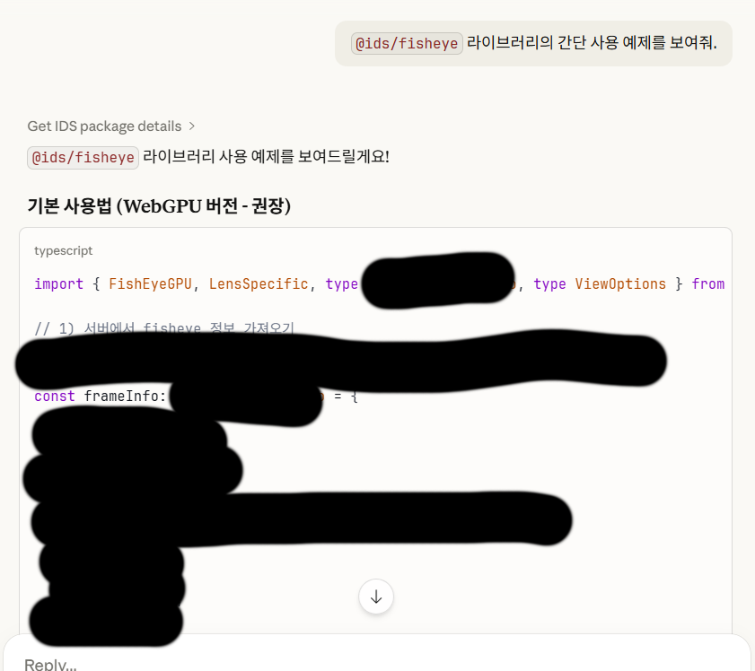

# Championing the Product from the Heart of Code

1. I am the one who turns our company’s business value into web UI—solving real-world problems with our Video Management System.
2. I developed a server that converts RTSP video streams into HLS, LL-HLS, DASH, WebRTC, and WebSocket so that video can be played in the browser.
3. I developed a WebAssembly decoder that decodes codecs that the web cannot decode natively.
4. I developed our in-house player that renders YUV binary on the GPU using shaders written in WGSL.
5. I used to believe that if there was a path in code, truth lay at the end of it.

# A Shift in Values

This ties directly to item 5 above. It’s a bit hard to put into words, but I clearly died and was born again. The items below didn’t change my values overnight, but they are among the handful of events that shaped that process.

1. A series of videos I watched on YouTube: “The Simple Developer,” “Sam Altman’s One-Person Unicorn,” etc.
2. My experience programming with SDD via the recent Vibe Coding trend and tools like Kiro and SpecKit
3. A case where my successor joined, judged the ceiling for growing as a front-end developer at our company, and left within the same year as soon as that ceiling was reached
4. My experience improving the UI of our company’s product
5. A long conversation with a friend over pork belly, kimchi stew, and soju at Samgun Kimchi Jjigae about the relationship between software, product, sales, and life

I’m skipping a lot, but in short:

1. I was not building software for the product. I was building software for the sake of software.
2. Software and developers should stay simple.
3. I am a researcher. In other words, I am a salesperson whose customers are SI WebApp developers.

## Life Is Sales

From that perspective, what matters in life?

1. Knowing clearly who your target audience is.
2. Knowing what that target needs.

Who is the target for the iNEX Design System library I develop, and what do they want?

1. Other in-house SI WebApp developers who use my web library.
2. What do those users need? Kind documentation on how to use it, or tutorials.

The company already provides Cursor IDE and Codex to developers on a team account. So the answer was to make it so that Cursor IDE and Codex could explain my library to users and generate example code. That’s why I built and released `@ids/mcp`.

The result was satisfying. Right after release, the team that builds the Cloud web service showed interest and asked me to present internally. It became a chance to tick off about two of my goals for the year without lifting a finger—I’ll talk about this year’s goals later.

## Developers Should Stay Simple

In a nutshell: learn when you need to. Build only the minimum MVP that can realize your idea. You don’t need new tech or new trends—use what you’re most comfortable with, and add things one by one when needed. In that process, you naturally start thinking in terms of code that can adapt to change. It may sound cliché, but I learned it the hard way.

uxlint is a tool that uses AI to automatically generate UX review reports. When I first built it, there was no UI—just a CLI tool. I didn’t use an AI SDK; I called the Web API directly and only supported the Anthropic provider.

Then, when the need arose, I added support for OpenAPI-compatible providers and others. That meant dropping hardcoded Anthropic-specific logic and abstracting the AI provider. In doing so, I naturally learned that using Vercel’s AI SDK makes abstraction and testing easier—and why people use that library. I now have a clear reason for using the Vercel AI SDK.

I then saw it being used in CI, and users needed to keep a record of reports and improvements per deployment, so I built the UXLint cloud service and learned Supabase along the way. I also set up a Gitea server, Drone CI, and a Kubernetes cluster on my Home Lab to manage my code.

The biggest hurdle was the login flow and fetching GitHub information, so I naturally studied and implemented OAuth 2.0 and PKCE.

Everything has an order; if you follow it, it sticks in your memory and you naturally understand why that technology is needed.

# Goals I Set in 2025

The goals I set last year were as follows. As I’ll explain below, they had issues because I made them without really knowing ROI or OKRs. But this is the only record I have from that time.

1. Increase open source contributions
2. Deploy services
3. Achieve 5% or more total return on assets

## Results & Issues With the Goals

1. Contributions did increase. From what I remember, I opened more than 10 pull requests last year, mostly for RTSP client libraries or logic changes in VSCode extensions. Fewer than five were merged, mainly because they weren’t famous libraries and the repos weren’t actively maintained.
2. At work we shipped a GIS-based live video viewing service, Clip Archive, and a recorder management dashboard. Personally I built uxlint, openapi-converter, and bruno2openapi.
   1. In the process I set up a Jenkins CI/CD pipeline. I build everything for our team’s web development—from core libraries to SI WebApps—so I needed a merciless system to keep my unchecked authority in check. For now we have unit tests, visual regression tests, and automated deployment.
   2. While doing personal projects I set up a Home Lab:
      - NVR, ONVIF compatible
      - IP Camera
      - Headscale VPN control server
      - DNS server
      - Drone CI server
      - Gitea server
      - K3s control plane and agent nodes for my toy projects
3. I have no baseline (I only started tracking and managing assets around mid-2025), so I don’t have exact numbers, but I’m fairly sure I cleared 5% easily. I also don’t really understand why I chose 5% as the target back then, so it doesn’t feel very meaningful.

The problem is that there was no quantifiable criterion, no written outcome or purpose for these goals, and no clear, actionable steps. I’ve set this year’s goals after fixing those issues.

## Vibe Coding: My Personal Take

A few things stood out. The Vibe Coding trend that many of my peers are into. When I saw it, the first thing I thought of was my own business. I plan to run a business under my own name someday, and SDD felt like a really attractive methodology. I actually deployed a few services on AWS using the SDD approach with the spec-kit library.

Leaving everything to AI is still a stretch because model performance isn’t there yet, but one thing is clear: productivity has improved noticeably. I was especially helped by using Context7 and Serena MCP.

I’m not saying I’m senior, but from having trained junior developers from scratch, I’d rather see more company support for these tools (e.g. RAG for technical support or field response, AI-based code review like Code Rabbit) than for unvetted juniors.

I do have concerns though:

> Outsourcing thinking

Using agents is a dopamine rush. You get an instant response. At first I would design the architecture, explain it to the agent, then review the generated code line by line. But once you’re soaked in that dopamine, sometimes you just sit there with your mouth open watching the code get generated.

I’ve always said to my colleagues and to myself: **my edge is in fundamentals and domain knowledge.** Fundamentals are the know-how I’ve built from experience—component structures that stay flexible to change, the ability to grasp what the customer wants in UI/UX, OOP and abstraction, soft skills—and domain knowledge is, of course, video playback.

> **I must not outsource my edge to AI.**

On a side note: don’t listen to music when coding or researching. I used to listen to music while working on personal projects after work, but after reading about focus I realized it was a major distraction.

## What to Do to Avoid Outsourcing Thinking?

After I became a developer, I stopped learning from books. I only read official docs in English and source code on GitHub, and I deliberately avoided technical books in Korean.

This year I changed my mind. In the midst of the AI upheaval and the crumbling of the fortress of human logic, I believe the fortress of reason in my own thinking is reading. I’m embarrassed to say that even as a developer, my English reading speed is still quite slow. So I’ve decided to include books in Korean and make reading a habit at least for this year.

# Goals for 2026

## North Star Objective

Grow into a front-end technical leader recognized both inside and outside the company.

---

## Objective 1. Establish a technical presence in the external developer community

- **KR1.** Reach 30+ GitHub followers
- **KR2.** Rebuild [gyeongho.dev](https://gyeongho.dev) on WebGPU/WebGL2 and get 10+ GitHub stars
- **KR3.** Ship one WebAssembly-based web game and get feedback from 10+ users
- **KR4.** Get 5+ PRs merged in external open source projects

### Initiatives (reference)

- Design and implement WebGPU personal website
- Study WGSL tutorial site
- Study WASM books and references bought in advance
- Resolve at least 3 issues in the lossless-cut project

---

## Objective 2. Be recognized as a front-end UI/UX technical leader within the company

- **KR1.** Refine Clip Archive user experience to remarkable quality
- **KR2.** Redesign iNEX Design System Library for visual excellence
  - KR1: Meet WCAG 2.2 recommendations
  - KR2: Meet ARIA recommendations
- **KR3.** Get other teams to adopt the iNEX Design System Library
  - KR1: Polish the CI/CD pipeline
  - KR2: Have someone other than me show Storybook and collect feedback
- **KR4.** Write documentation for junior web developers
  - KR1: Find and translate into Korean materials that help with video/image understanding
  - KR2: Write documentation for juniors who will develop the iNEX Design System

### Initiatives (reference)

Censored

---

## Objective 3. Censored

**KR1.** Censored
**KR2.** Censored

### Initiatives (reference)

Censored
