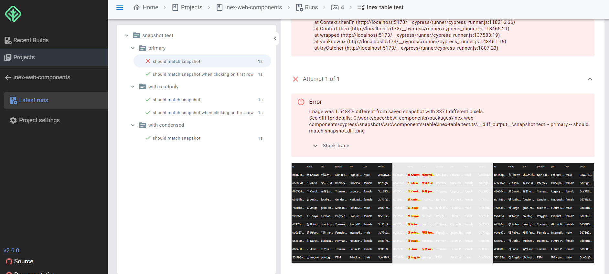
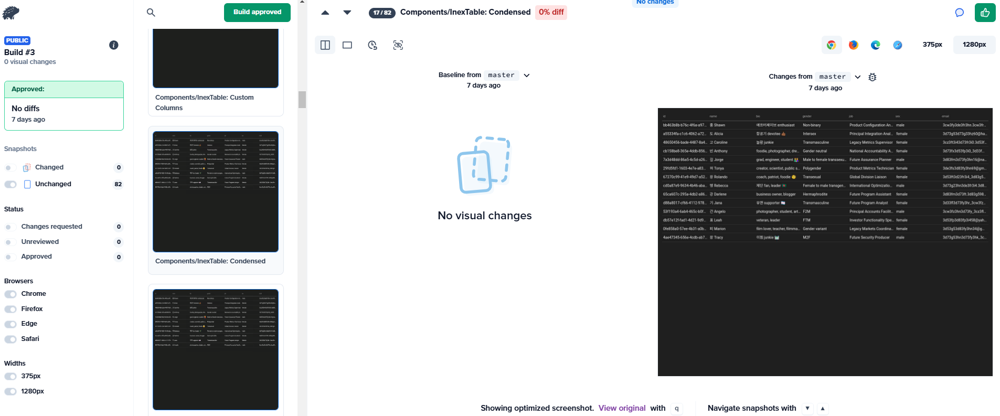

# 의도된 디자인 변경인지 판단을 대신 해주는 법

회사에서 프론트 업무를 맡기 시작한 후 나는 디자인 시스템을 만들기 시작했다. 40개 정도의 컴포넌트를 만들었고 그걸 4개 서비스에서 실제로 사용했다.
4개 서비스 중 어느 한 곳에서 버그가 발생하면, 일단 당장 서비스는 돌아가야 하니까 급하면 디자인 시스템 컴포넌트까지 땜질을 하게 되는데 다음과 같은 상황이 발생하게 된다.

- 공통 스타일을 import해서 shadowDOM 내에 붙이는 다른 컴포넌트의 UI가 깨짐.
- 기능에 대한 수정이라 UI는 상관없겠다고 생각했는데 알고보니 그 기능이 동적으로 DOM 요소를 건드리던 기능이었고 배포하고 나서야 아차.
- 아이콘 바꾸고 사이즈 똑같다고 들었는데 알고보니 높이 3px 차이가 났고 3개 서비스는 문제가 없지만 1개 서비스는 그 3px 때문에 위아래가 밀림.

이걸 수동으로 확인하려면 어떻게 해야 할까? 혹은 특정 시퀀스에서만 UI가 망가지는데 그 시퀀스가 노동 집약적이라면 어떻게 해야 할까?

# 시각적 회귀 테스트 환경과 도구

나의 경우,

- 각각의 서비스들: 스테이징 서버 구축 후 BackstopJS 사용
  - 페이지 단위, 혹은 사용자의 동작에 따른 부수효과를 테스트해야 하기 때문에
- 디자인 시스템: Cypress + 자체 호스팅 테스트 대시보드 서버 / Percy.io 동시에 사용
  - 어차피 각 서비스는 컴포넌트 단위로 import해서 사용하기 때문에 페이지 접근하고 비교하는게 의미가 없음
  - Storybook 통합이 가능해서 테스트 코드를 안짜도 테스트를 돌릴 수가 있다.

디자인 시스템의 경우 Cypress Image Snapshot이라는 플러그인을 사용해서 래퍼런스 이미지 스냅샷을 직접 만들어 git에 올린 뒤,
minio storage + mongodb + 대시보드 서버로 구성된 자체 테스트 대시보드 서버를 이용하고 있다. 원인은 비용. Percy가 무료계정은 한달에 보낼 수 있는 Request가 제한이 있음.

그래서 Percy는 2주에 한번씩 돌아가고 자체 호스팅 테스트 대시보드에 올라가는 시각 회귀 테스트는 매일 돌아가고 있다.

# Cypress Image Snapshot + 자체 호스팅 테스트 대시보드 서버

cypress와 image snapshot 플러그인, 그리고 자체 호스팅 서버 조합이면 무려 무료로 시각적 회귀 테스트를 돌릴 수 있다.  
단점은, 디자인 변경이 있을 때 Approve하는 기능이 없기 때문에 일일히 래퍼런스 이미지 다시 찍고 git에 올려줘야 그제서 통과를 한다.

# Percy + Storybook

Percy는 다들 익숙할 것이다. Storybook 통합 가능하고 Cypress SDK도 제공해준다. 편하다.  
단점은 돈이 든다. 아무리 내가 서비스를 사랑한다지만, 회사 제품 만드는데 내 돈 내기가 싫기 때문에 2주에 한번씩 돌린다.

# Jenkins CI 통합할 때 주의사항

## 도커 관련 이슈

현재 jenkins의 도커 파이프라인 최신버전에서 Windows 환경 도커 에이전트에 이슈가 존재함(`C:\\`인 windows 경로가 구분자인 `:`로 인식되어 파싱오류로 도커 에이전트의 볼륨 등 설정 시 에러가
발생하는 문제임). Linux 기반인 남는 PC가 없어서 어쩔 수 없이 Windows OS인 Jenkins 서버에 해당 서버를 Jenkins agent로 실행하고 있으나 Linux 환경인 도커 에이전트를 하나 만드는
것을 추천함. 혹은, Jenkins 서버 자체를 docker로 실행하는 것을 추천.

## Jenkinsfile과 그 Trigger 조건에 대해

Pipeline 트리거 조건에 굉장히 조심해야 한다. 잘못하면 순식간에 Percy 무료계정에 할당된 Request를 다 쓰고 손가락만 빨게 될 수도 있다.  
나의 경우 좀 특수한 상황인데, 회사 사내 git 서버의 심각한 인덱싱 성능 문제로 프론트 개발자는 git을 못쓰게 하기 때문에 사내 Git 서버에 디자인 시스템을 위한 레포지터리를 못만드는 상황이다.  
그래서 백엔드 개발자의 레포지터리에 살며시 동거하고 있는 중인데 내가 만약 master branch에 trigger를 걸어놓으면 백엔드의 기능개발 혹은 커밋주기에 맞춰서 테스트가 돌아가게 될 것이었다.  
계산때려보니 2주일에 한번씩 Percy 테스트 돌리면 한달에 5000개 정도의 Request를 보내게 되던데 백엔드 개발자가 기능변경할 때마다 혹은 추가할 때마다 테스트 돌려버리면 순식간에 다 쓰게 될 것이었다.

그래서 다른 방법을 강구해야 했고 그중 웹 훅을 택했다. Jenkins에 jeneric web hook 파이프라인을 추가하여 내가 jenkins 서버에 각각의 특정 URL로 요청을 날리면 각각의 Jenkins
파이프라인이 동작하게 만들었다.
