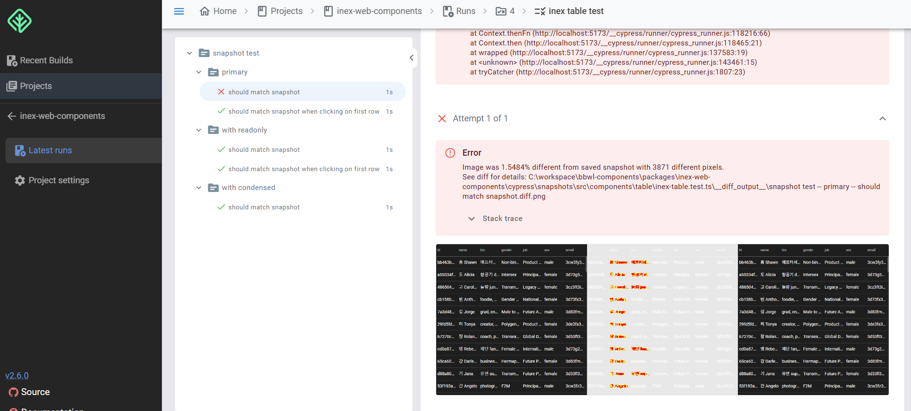
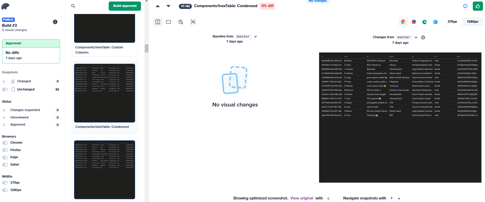

# 意図されたデザイン変更かどうかを判断してくれる方法

会社でフロントエンドの業務を担当し始めた後、私はデザインシステムを作り始めた。40個程度のコンポーネントを作成し、それを4つのサービスで実際に使用した。
4つのサービスのいずれかでバグが発生すると、とりあえずサービスは動かさなければならないので、緊急時にはデザインシステムのコンポーネントまで応急処置をすることになるが、次のような状況が発生する。

- 共通スタイルをimportしてshadowDOM内に貼り付ける他のコンポーネントのUIが壊れる。
- 機能に関する修正なのでUIは関係ないと思っていたが、実はその機能が動的にDOM要素を操作していた機能で、デプロイしてから気づく。
- アイコンを変更してサイズは同じだと聞いていたが、実は高さが3px違いがあり、3つのサービスは問題ないが1つのサービスはその3pxのせいで上下がずれる。

これを手動で確認するにはどうすればいいだろうか？あるいは特定のシーケンスでのみUIが壊れるのに、そのシーケンスが労働集約的であればどうすればいいだろうか？

# 視覚的回帰テストの環境とツール

私の場合、

- 各サービス: ステージングサーバー構築後BackstopJSを使用
  - ページ単位、またはユーザーの操作による副作用をテストする必要があるため
- デザインシステム: Cypress + 自社ホスティングテストダッシュボードサーバー / Percy.ioを同時に使用
  - いずれにせよ各サービスはコンポーネント単位でimportして使用するため、ページにアクセスして比較することに意味がない
  - Storybook統合が可能で、テストコードを書かなくてもテストを実行できる

デザインシステムの場合はCypress Image Snapshotというプラグインを使用してリファレンス画像スナップショットを直接作成してgitにアップロードした後、
minio storage + mongodb + ダッシュボードサーバーで構成された自社テストダッシュボードサーバーを利用している。理由は費用。Percyの無料アカウントは月に送信できるRequestに制限がある。

そのためPercyは2週間に1回実行し、自社ホスティングテストダッシュボードにアップロードされる視覚的回帰テストは毎日実行されている。

# Cypress Image Snapshot + 自社ホスティングテストダッシュボードサーバー

cypressとimage snapshotプラグイン、そして自社ホスティングサーバーの組み合わせなら無料で視覚的回帰テストを実行できる。  
欠点は、デザイン変更があるときにApproveする機能がないため、逐一リファレンス画像を再撮影してgitにアップロードしないと通らない。

# Percy + Storybook

Percyはみんな馴染みがあるだろう。Storybook統合可能でCypress SDKも提供してくれる。便利だ。  
欠点は費用がかかる。いくらサービスを愛していても、会社製品を作るのに自分のお金を出すのは嫌なので2週間に1回実行している。

# Jenkins CI統合時の注意事項

## Docker関連のIssue

現在jenkinsのDockerパイプライン最新版でWindows環境のDockerエージェントにIssueが存在する（`C:\\`のようなWindowsパスが区切り文字の`:`として認識され、パースエラーでDockerエージェントのボリューム等設定時にエラーが
発生する問題）。Linuxベースの余っているPCがないため、やむを得ずWindows OSのJenkinsサーバーにそのサーバーをJenkins agentとして実行しているが、Linux環境のDockerエージェントを1つ作る
ことを推奨する。または、Jenkinsサーバー自体をDockerで実行することを推奨する。

## JenkinsfileとそのTrigger条件について

Pipelineのトリガー条件には非常に注意が必要だ。誤ると瞬く間にPercyの無料アカウントに割り当てられたRequestを全て使い果たし、指を咥えるだけになってしまうかもしれない。  
私の場合は少し特殊な状況で、会社の社内gitサーバーの深刻なインデックス性能問題によりフロントエンド開発者はgitを使えないため、社内Gitサーバーにデザインシステムのためのリポジトリを作れない状況である。  
そのためバックエンド開発者のリポジトリにこっそり同居している中、もし私がmaster branchにtriggerを設定すればバックエンドの機能開発やコミット周期に合わせてテストが実行されることになっていた。  
計算してみると2週間に1回Percyテストを実行すれば月に5000個程度のRequestを送信することになるが、バックエンド開発者が機能変更や追加するたびにテストを実行してしまえば瞬く間に全て使い果たすことになっていた。

そのため別の方法を講じる必要があり、その中でWebhookを選択した。JenkinsにGeneric Webhookパイプラインを追加し、私がjenkinsサーバーにそれぞれの特定URLにリクエストを送るとそれぞれのJenkins
パイプラインが動作するようにした。
