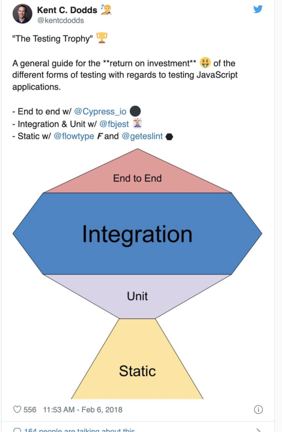

# テスト可能なコードとモッキング

## ユニットテストの「ユニット」とは何か？？

私がよく読むマーティン・ファウラーおじさんのブログに以下のような記事があります。

> So there's some common elements, but there are also differences. One difference is what people consider to be a _unit_. Object-oriented design tends to treat a class as the unit, procedural or functional approaches might consider a single function as a unit. But really it's a situational thing - the team decides what makes sense to be a unit for the purposes of their understanding of the system and its testing. Although I start with the notion of the unit being a class, I often take a bunch of closely related classes and treat them as a single unit. Rarely I might take a subset of methods in a class as a unit. However you define it doesn't really matter.

バックエンド開発者は主にOOPに興味があるため、大部分はClassをUnitとして扱います。

しかし、誤解してはならない部分があります：

> テストは**コード**のユニットを検証してはならない。**動作のユニット**を検証する必要がある。通常、動作のユニットはOOP開発者の場合Classであるため、そのようにするだけです。複雑なビジネスロジックを展開していくと、動作のユニットは**小さな関数1つになることもあり、複数のクラスにわたって1つの動作を解決する場合もあります**。

後で再度説明します。

# ユニットテストは本当に重要か？

[https://martinfowler.com/articles/2021-test-shapes.html](https://martinfowler.com/articles/2021-test-shapes.html)



後で再度説明します。

# テストダブルの種類

私はこれまでMockitoライブラリだけを使用すればすべてMockだと思っていましたが、そうではありません。名前だけがMockで、私はBehavior Verificationを行いませんでした。単にStubのように使用していただけです。

私が好きなマーティン・ファウラーおじさんがブログに投稿した記事の一部：

> Meszaros uses the term **Test Double** as the generic term for any kind of pretend object used in place of a real object for testing purposes. The name comes from the notion of a Stunt Double in movies. (One of his aims was to avoid using any name that was already widely used.) Meszaros then defined five particular kinds of double:
>
> - **Dummy** objects are passed around but never actually used. Usually they are just used to fill parameter lists.
> - **Fake** objects actually have working implementations, but usually take some shortcut which makes them not suitable for production (an [in memory database](https://martinfowler.com/bliki/InMemoryTestDatabase.html) is a good example).
> - **Stubs** provide canned answers to calls made during the test, usually not responding at all to anything outside what's programmed in for the test.
> - **Spies** are stubs that also record some information based on how they were called. One form of this might be an email service that records how many messages it was sent.
> - **Mocks** are what we are talking about here: objects pre-programmed with expectations which form a specification of the calls they are expected to receive.
>
> Of these kinds of doubles, only mocks insist upon behavior verification. The other doubles can, and usually do, use state verification. Mocks actually do behave like other doubles during the exercise phase, as they need to make the SUT believe it's talking with its real collaborators - but mocks differ in the setup and the verification phases.

# なぜモッキングが悪いのか？

テストコードは動作をユニットとして記述する必要があります。そのため、一部の人はテストコードを必ずインターフェースで記述すべきだと言うこともあります（すべてをそのようにするのは少し過剰で...意味のないインターフェースの乱用は後で修正コストが高くなる可能性があります）。
しかし、Mockオブジェクトを作成すると、依存性に関連するコードがテストコードに入るのか？または、Mockオブジェクトが持つメソッドが何回実行されるべきで、この入力からこの出力が出るべきかをテストコードで定義するのか？
これ自体が既に動作ではなく実装がテストコードに露出していることと変わりません。では、実装がテストコードに露出するとなぜいけないのか？リファクタリング耐性が低下すると、テストコードの信頼性に問題が生じ、メールが送られても人々は無視します...

では、いつモッキングすべきか、モッキングの短所は何かを例を通じて理解しましょう。

# いつモッキングすべきか？

[いつモッキングすべきか、Stackoverflow](https://stackoverflow.com/questions/38181/when-should-i-mock)

いつモッキングすべきかに関する優れた回答を見ると：

> Mock objects are useful when you want to test **interactions between a class under test and a particular interface**.

モッキングはいつするのか？まさに、SUTと特定のインターフェース間の相互作用をテストしたいときです。しかし、これが常に良いのかというと、そうとは限りません。

# なぜモッキングが悪いのか？例を挙げてみよう

以下の例が記されています。以下はMySorterというクラスをテストするコードです。

```
// the correct way of testing
testSort() {
    testList = [1, 7, 3, 8, 2]
    MySorter.sort(testList)

    assert testList equals [1, 2, 3, 7, 8]
}


// incorrect, testing implementation
testSort() {
    testList = [1, 7, 3, 8, 2]
    MySorter.sort(testList)

    assert that compare(1, 2) was called once
    assert that compare(1, 3) was not called
    assert that compare(2, 3) was called once
    ....
}
```

もし後でMySorterの実装変更が行われた場合、2番目のテストコードは失敗するでしょう。しかし、その失敗の原因は何か？テストコード自体の欠陥です。これではテストコードを信頼できません。動作は同一ですが、内部実装が変わりました。しかし、テストが失敗する状況？？これを**リファクタリング耐性の低いテストコード**と言います。

# 参考までに、テストフレームワークを信頼するな

テストフレームワークのMock~~というメソッドまたはクラスを使用してテストコードを記述することが多くありました（MockitoやJestなど広く使用されるフレームワークは一般的にMock~~という名前のメソッドがあります）。実際、Mock frameworkは使用に非常に厳格な制約があるわけではないため、開発者がMockをStubとして使用しても、コンパイル時にエラーを出すか、これが不可能です。

つまり、私が言いたいのは、Mockフレームワークがmock objectをstubとして使用しても、それほど気にしないということです。以下は`sendInvitations()`メソッドのテストで、協力オブジェクトはPdfFormatter、MailServerの2つです。

```
testInvitations() {
   // train as stub
   pdfFormatter = create mock of PdfFormatter
   let pdfFormatter.getCanvasWidth() returns 100
   let pdfFormatter.getCanvasHeight() returns 300
   let pdfFormatter.addText(x, y, text) returns true
   let pdfFormatter.drawLine(line) does nothing

   // train as mock
   mailServer = create mock of MailServer
   expect mailServer.sendMail() called exactly once

   // do the test
   sendInvitations(pdfFormatter, mailServer)

   assert that all pdfFormatter expectations are met
   assert that all mailServer expectations are met
}
```

このようにした場合、SUTの実装方式が変わると、テストコードが失敗するでしょう。これを成功させるために、trainingに関するコードを無数に追加する必要があるかもしれません。しかし、このようなtrainingコードが動作に関するコードか？いいえ、これは実装がどのように構造化されているかを示すコードに該当するでしょう。

## MockはStubではない

[https://martinfowler.com/articles/mocksArentStubs.html](https://martinfowler.com/articles/mocksArentStubs.html)

私が愛するマーティン・ファウラーおじさんはこう言います：

> **Key Points:**
>
> 1. **State Verification vs Behavior Verification**: Stubs use state verification, where you check the state of the System Under Test (SUT) and its collaborators after the method is exercised. Mocks use behavior verification, where you check if the SUT made the correct calls on its collaborators.
> 2. **Setup Phase**: In tests using Stubs, the setup phase involves creating instances of the SUT and its collaborators. In tests using Mocks, the setup phase is divided into two parts: data and expectations. Data sets up the objects you're interested in, and expectations indicate which methods should be called on the mocks when the SUT is exercised.
> 3. **Verification Phase**: In Stubs, you use assertions to check the state of the SUT and its collaborators. In Mocks, you verify that the mock objects were called according to their expectations, in addition to using assertions on the SUT.

SUTは、私たちが現在テストしているクラスを意味します。

そこで1番に集中しましょう。Stubは返される「状態」を検証することが重要であり、Mockは「行為」を検証することが重要です。つまり、Behavior Verificationを行わずに「Mockを作成しました~~」と言ってはいけないということです。Stubを作成しておきながら誤解しているのは明らかです。例として、以下のような協力オブジェクトインターフェースを想像してみましょう。

```java
public interface MailService {
  public void send (Message msg);
}
```

これをStubとして実装すると：

```java
public class MailServiceStub implements MailService {
  private List<Message> messages = new ArrayList<Message>();
  public void send (Message msg) {
    messages.add(msg);
  }
  public int numberSent() {
    return messages.size();
  }
}
```

このようになり、これをTestコードで使用すると：

```java
class OrderStateTester...

  public void testOrderSendsMailIfUnfilled() {
    Order order = new Order(TALISKER, 51);
    MailServiceStub mailer = new MailServiceStub();
    order.setMailer(mailer);
    order.fill(warehouse);
    assertEquals(1, mailer.numberSent());
  }
}
```

このようになります。しかし、Mockを実装した場合、このテストコードはどのように変わるでしょうか？

```java
class OrderInteractionTester...

  public void testOrderSendsMailIfUnfilled() {
    Order order = new Order(TALISKER, 51);
    Mock warehouse = mock(Warehouse.class);
    Mock mailer = mock(MailService.class);
    order.setMailer((MailService) mailer.proxy());

    mailer.expects(once()).method("send");
    warehouse.expects(once()).method("hasInventory")
      .withAnyArguments()
      .will(returnValue(false));

    order.fill((Warehouse) warehouse.proxy());
  }
}
```

これはStubをMockと誤解する場合について、なぜ異なるかの説明を記したもので、論点から外れた段落です。しかし、私が犯した過ちを忘れないという意味で記しました。

## 種類を知らなくてもフレームワークだけうまく使えばテストは書けるのではないか？

もちろん、テストは書けます。しかし、いつMockを使用すべきか、Fake/Spy/Stubを使用すべきか、または単に実際のオブジェクトを使用すべきかを知らずにテストコードを書くと、確実にテストフレームワークの公式文書または例を基準にテストコードを書くことになり、高い確率でロンドンスタイルモッキングを試みることになるでしょう。

簡単に言えば、ロンドンスタイルはすべての動作に対してMockを使用する方式です。ここで、MockはBehavior Verificationを行うとされています。**この時、実装がテストコードに露出します。テストコードが実装に結合されます。したがって、リファクタリングを行うと、テストが壊れる可能性が高くなります。実装が。変わるからです。**

# 論点に戻って：リファクタリング耐性をどのように確保するか？

これは先ほど上で記したリンクの原文ですが：

How to fix that? Easily:

- Try using real classes instead of mocks whenever possible. Use the real `PdfFormatterImpl`. If it's not possible, change the real classes to make it possible. Not being able to use a class in tests usually points to some problems with the class. Fixing the problems is a win-win situation - you fixed the class and you have a simpler test. On the other hand, not fixing it and using mocks is a no-win situation - you didn't fix the real class and you have more complex, less readable tests that hinder further refactorings.
- Try creating a simple test implementation of the interface instead of mocking it in each test, and use this test class in all your tests. Create `TestPdfFormatter` that does nothing. That way you can change it once for all tests and your tests are not cluttered with lengthy setups where you train your stubs.

All in all, mock objects have their use, but when not used carefully, **they often encourage bad practices, testing implementation details, hinder refactoring and produce difficult to read and difficult to maintain tests**.

1番目はすぐ下で説明するMockスタイルと関連があります。しかし、2番目は？インターフェースに対する簡単な実装を持つクラスを1つ別に作成するという意味ですが、これはなぜかというと、テストメソッドごとにtraining codeが入るのが良くないためです。

正直、2番目の方法については、少し現実的ではないのは、インターフェースで明確に区分されているレガシーコードを見たことがなく（設計を完全に変える必要があるが、時間がないためそれができない。締切後に行えばいいのではないか？プロジェクト1つが売れたら終わりなので、メンテナンスを行うのを見たことがない...私が一人でやります）、テスト用に実装体を作成するように求めると、これも時間がかかりすぎます。

# Mockスタイル：デトロイトスタイルとロンドンスタイル

私のおじさん（マーティン・ファウラー）はこう言います：

> The **classical TDD** style is to use real objects if possible and a double if it's awkward to use the real thing. So a classical TDDer would use a real warehouse and a double for the mail service. The kind of double doesn't really matter that much.
>
> A **mockist TDD** practitioner, however, will always use a mock for any object with interesting behavior. In this case for both the warehouse and the mail service.

Classical方式は別の言葉でデトロイトスタイルであり、Mockist方式は別の言葉でロンドンスタイルです。

- デトロイトスタイル
  - 長所：リファクタリング耐性が高い
  - 短所：Localityが良くない
- ロンドンスタイル
  - 長所：Localityが良い
  - 短所：リファクタリング耐性が低い

ロンドンスタイルは本当に良さそうですが、リファクタリング耐性が低いと、結局Test Codeはメンテナンスコストを増加させます。現実的に、すべての外部依存性をすべてMockすることはできません。
publicな部分または頻繁に変わらない部分はMockをし、privateな部分または頻繁に変わる部分は実際のオブジェクトを使用しましょう。

例えば、認証サーバーAPIとすると、これは既に会社創立以来の長い歴史を誇るでしょうが、これは実装が変わりません。インターフェースでMockしても問題ありません。また、自社DBを使用する部分もありますが、これも会社が倒産するまで変わらないという確信があるため、単にMockして使用します。

# Unit Testを書く目的は何か？？

私は問題がどこで発生したかを正確に知りたいため、Unit Testを書いていました。しかし、それは現実的に困難で、代替手段は多くあります。

上で言ったように、ロンドンスタイルはリファクタリング耐性が低いです。このようにテストコードを書くと：

- ロンドンスタイルで行うと、Unit Testが増えるにつれてEntropyが増加します（負債が増加します）
  - リファクタリングするたびにUnit Testは壊れ、そのたびに修正する必要があります。モッキングも新しく行う必要があります
- デトロイトスタイルで行うと、Localityが良くありません。
  - テストコードの失敗によりバグ発生は捕捉できますが、そのバグがどこで発生したか分かりません。
  - SUTに問題がなくても実際のオブジェクトを使用するため、依存性を通じてバグが伝播してきた可能性もあります。
- そして実際、問題が発生したかを知りたい場合：
  - お金を使えばよいです。APM monitoringツールが多くあるため...

これだから、統合テストがより重要だという言葉が出てくるのです。現実的に見て：

Unit Test：デトロイトスタイル & 統合テストをより多く

この方式が適切だと思います。Localityが低いとは言っても、実際リファクタリングするたびにテストコードを実行するなら、直前で修正した部分を再確認すればよいので、それほど大きな問題ではないでしょう？もちろん、ロンドンスタイルよりもlocalityが悪いでしょうが。

# モッキングのためにテストが困難な場合

1. 設計を誤ったのではないか考察する必要があります。テスト可能なコードはオブジェクト指向設計から生まれます。
2. 該当SUTがビジネス的に重要な部分かを再考する必要があります。

<iframe width="560" height="315" src="https://www.youtube.com/embed/RoQtNLl-Wko?si=gwjSTy64L0Un6-rU" title="YouTube video player" frameborder="0" allow="accelerometer; autoplay; clipboard-write; encrypted-media; gyroscope; picture-in-picture; web-share" referrerpolicy="strict-origin-when-cross-origin" allowfullscreen></iframe>

# TDDを捨てよ。テストは多く行え

時々、TestコードとTDDを混同する人がいますが、それは違います。TDDは単なる方法論です。Testコードは多く記述する必要があります。ただし、「意味のある」テストコードを。

<iframe width="560" height="315" src="https://www.youtube.com/embed/gs1qM1TF5zA?si=s4hroFQRiSpyqeS4" title="YouTube video player" frameborder="0" allow="accelerometer; autoplay; clipboard-write; encrypted-media; gyroscope; picture-in-picture; web-share" referrerpolicy="strict-origin-when-cross-origin" allowfullscreen></iframe>
